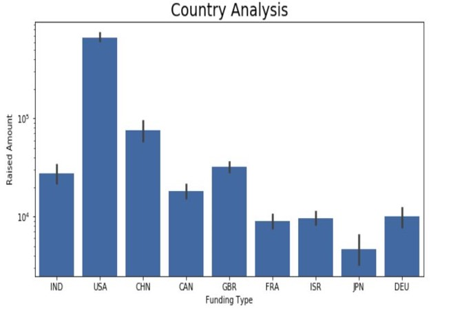

  
  
  
  
  
   
  
  

# Spark Funds Data Analysis Project

This repository contains the code and analysis for the Spark Funds Data Analysis project. The project aims to analyze global investment trends and identify the best sectors and countries for investment.

#### Project Overview

The main objectives of this project are:

1. Data Cleaning: Clean and preprocess the provided data to ensure consistency and reliability.
2. Funding Type Analysis: Analyze different types of fundings and determine the most suitable type for investment.
3. Country Analysis: Identify the top countries for investment based on specific criteria.
4. Sector Analysis: Extract primary sectors and analyze investment trends within those sectors.
5. Plots: Create visualizations to present the findings of the analysis.

#### Checkpoints

##### Checkpoint 1 - Data Cleaning

- Unique companies: 66368
- Unique key: "permalink"

##### Checkpoint 2 - Funding Type Analysis

- Most suitable investment type: "VENTURE"

##### Checkpoint 3 - Country Analysis

- Top three countries based on highest amount of funding and English as a primary language: USA, BRITAIN, INDIA

##### Checkpoint 4 - Sector Analysis 1

- Mapped primary sectors of each company to their respective main sectors for investment.

##### Checkpoint 5 - Sector Analysis 2

- Most heavily invested sectors for each country:
  - Country 1: Others; SOCIAL, FINANCE, ANALYTICS, ADVERTISING
  - Country 2: Others; SOCIAL, FINANCE, ANALYTICS, ADVERTISING
  - Country 3: Others; SOCIAL, FINANCE, ANALYTICS, ADVERTISING

##### Checkpoint 6 - Plots

For visualizations and plots, please refer to the `plots/` directory. Here are the specific plots presented:

1. [Plot 1](plots/plot1.png): Description of the plot.
2. [Plot 2](plots/plot2.png): Description of the plot.
3. [Plot 3](plots/plot3.png): Description of the plot.

#### Result

  
  
  

#### Author

Akshay Hooda   

Shivnath Chauhan

Saksham Sharma

Yuvraj Koundal

Chitrang Juneja

#### License

This project is licensed under the [License Name] License - see the [LICENSE](LICENSE) file for details.

  
  
  
  
  
   
  
  

